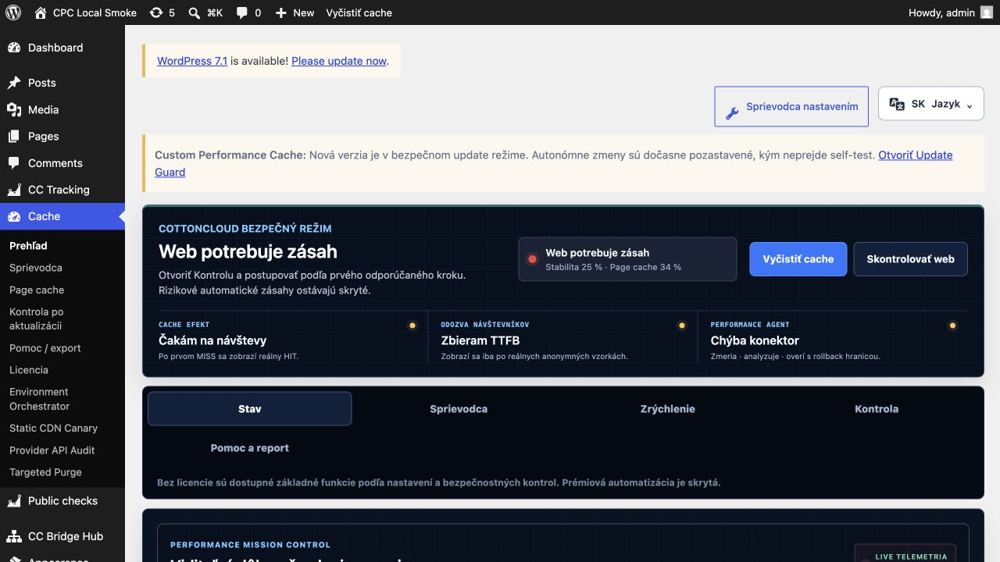
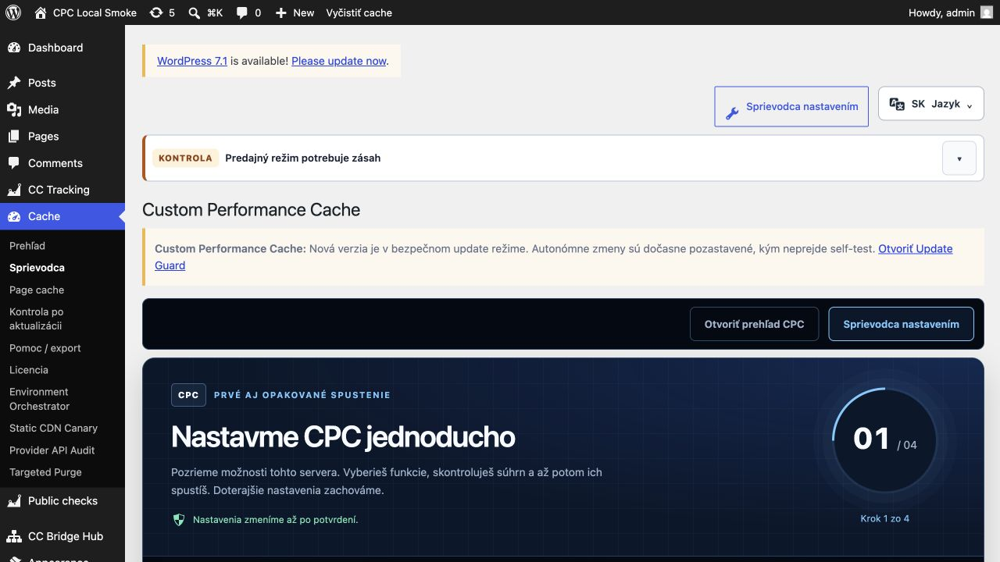
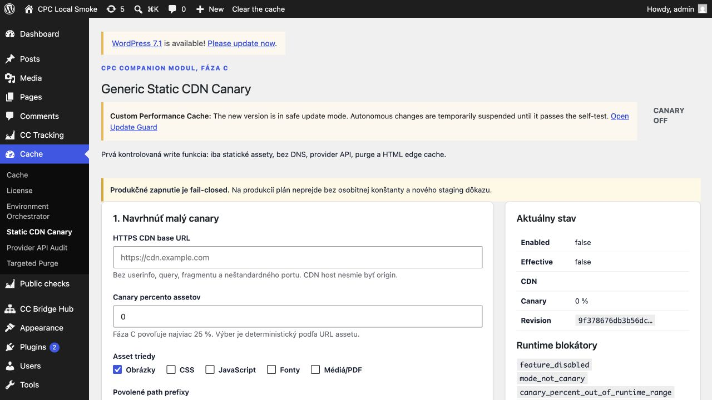
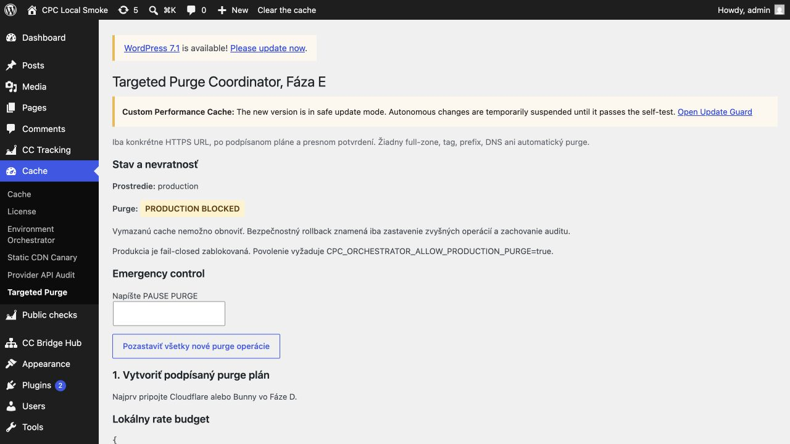

# CPC 1.0.317: onboarding, CDN a bezpečné overenie na WordPresse

Custom Performance Cache (CPC) je WordPress performance plugin, ktorý vyvíja
[CottonCloud na Slovensku](https://cottoncloud.sk/pluginy/custom-performance-cache/).
Nie je to iba slovenský preklad zahraničného pluginu. Táto dokumentácia
vysvetľuje používateľské a bezpečnostné hranice aktuálnej zákazníckej verzie
`1.0.317`.

> Verzia `1.0.317` je dokumentačný a verziový nástupca overených runtime bajtov
> `1.0.316`. CDN workflow vznikol v skoršej vetve; číslo `1.0.317` preto
> neprezentujeme ako deň, keď bola funkcia prvýkrát naprogramovaná.

## Jednoduchý sprievodca namiesto slepého zapnutia

CPC ponúka základný prehľad a štvor-krokový sprievodca. Najprv zistí dostupné
možnosti prostredia, potom používateľ vyberie rozsah, skontroluje súhrn a až
nakoniec potvrdí zmenu. Bez licencie zostávajú dostupné základné funkcie;
prémiová automatizácia je oddelená a neskrýva sa za predstieraný automatický
zásah.

## Tri rozdielne stavy CDN

V CPC neznamená uložený provider automaticky fungujúcu CDN. Rozlišujeme:

1. **configured** — údaje a provider sú uložené;
2. **connected** — ohraničená API kontrola potvrdila pripojenie;
3. **delivery-certified** — presný verejný statický súbor reálne prešiel cez
   CDN a overená sekvencia doručenia prešla.

Static CDN Canary je predvolene vypnutý. Produkčný plán je fail-closed, povoľuje
najviac 25 % vhodných statických URL a nezahŕňa prihlásenie, košík, pokladňu,
účet ani inú transakčnú stránku. CPC nemení DNS a nezapína HTML edge cache.

## Čo bolo fyzicky overené

Dňa 9. septembra 2026 prešli Cloudflare aj Bunny na izolovanom FORPSI
WooCommerce laboratóriu rovnakou kontrolovanou sekvenciou pre jeden presný
verejný PNG súbor:

`MISS -> HIT -> exact-URL purge (HTTP 200) -> MISS -> HIT`

Tento dôkaz potvrdzuje daný workflow, nie univerzálnu kompatibilitu každej
tarify, servera, témy a kombinácie pluginov. Počas testu sa nemenilo DNS,
nezapínala sa HTML edge cache a nevykonával sa globálny purge.

## Cielené čistenie cache

Targeted Purge pracuje iba s povolenou presnou HTTPS URL po podpísanom pláne a
potvrdení. Produkčný zásah zostáva bez osobitnej serverovej konštanty
zablokovaný. CPC tým oddeľuje overenie od nevratného hromadného čistenia.

## Websupport, Webglobe a FORPSI/Aruba

CPC obsahuje hostingové profily, detekčné signály a testovacie scenáre pre
prostredia typické pre Websupport, Webglobe a FORPSI/Aruba. Profil pomáha vybrať
bezpečný počiatočný postup, ale nie je certifikátom každej hostingovej tarify.

Na konkrétnom webe sa vždy osobitne overuje:

- verzia PHP a oprávnenia cache úložiska;
- existujúca hostingová page cache, reverse proxy a CDN;
- prihlasovanie, formuláre, REST a AJAX;
- pri WooCommerce košík, pokladňa a účet;
- prvá aj opakovaná návšteva na desktope, tablete a mobile;
- cesta späť k predchádzajúcej konfigurácii.

## Základný režim a PRO režim

Základný režim je určený pre bezpečné prvé nastavenie a kontrolu. PRO režim
sprístupňuje podrobnejšie riadenie vrstiev a automatizácie, ale stále nemení
pravidlo: kritické používateľské cesty sa necacheujú naslepo a každá produkčná
zmena musí byť merateľná a vratná.

Aktuálnu dostupnosť, cenu, licenčné podmienky a verziu ponúkanú zákazníkom vždy
overte na [kanonickej produktovej stránke
CPC](https://cottoncloud.sk/pluginy/custom-performance-cache/). Ďalšie technické
vysvetlenia sú v [dokumentácii
CottonCloud](https://cottoncloud.sk/dokumentacia/?docs_product=custom-performance-cache).

## Pôvod obrázkov a hranica dôkazu

Všetky štyri obrázky sú anonymizované snímky skutočného rozhrania CPC `1.0.317`
z izolovaného lokálneho laboratória. Neobsahujú zákaznícke domény, objednávky,
emaily, IP adresy, prístupové údaje ani licenčné kľúče. Nejde o AI-generované
makety ani o dôkaz produkčného výsledku na zákazníckom webe.
